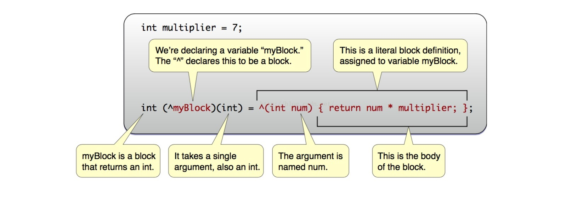

块（block）是添加到C、Objective-C和C++的语言级功能。它允许你创建不同的代码段，可以像传值一样传递给方法或函数。块是Objective-C对象，也就是说它们可以被添加到像`NSArray`和`NSDictionary`这样的集合中，其还具有从封闭范围捕获值的能力。

块是一个独立的代码片段，始终存在于另一个编程结构的范围内，如在一个方法的主体。块可以捕获块外变量的值，但外部对于块内发生的事情一无所知。在块内不能直接修改局部变量的值，如需修改需用`__block`修饰局部变量。

## 1. 创建demo

这篇文章演示的应用程序由多个彼此独立的部分组成，代码运行结果可以在控制台输出，但为了介绍使用block传值，这里使用*Single View Application*模板，*Product Name*为*Block*。

> 在这篇文章里，没有特殊说明位置的代码都可以写在`ViewController.m`文件的`viewDidLoad`方法中。运行可以在控制台输出。

## 2. Block的声明、定义、赋值与调用



### 2.1 Block的声明

Block声明遵循以下语法：

```
返回值类型 （^block名称)(参数列表)
```

Block声明的语法和C函数非常相似，不同之处在于block有*脱字符^*。

- 返回值类型：任何Objective-C支持的数据类型。如果不返回任何内容，则为`void`。
- ^block名称：block名称前的脱字符`^`不可省略。块名称和其它变量或方法名命名规则一致。脱字符和块名称都在圆括号内。
- 参数列表：要在块上传递的参数列表，与方法的参数一样。如果不传递参数，设置为`void`。有多个参数时，参数间用逗号隔开。参数列表必需在圆括号内。

下面是一些block的声明：

```
    int (^firstBlock)(NSString *param1, int param2);    // 返回类型为int 参数1为NSString类型 参数2为int类型
    void (^showName)(NSString *pro648);                 // 无返回内容 参数为NSString类型
    void (^allVoid)(void);                              // 无返回内容 不传递参数
    NSDate *(^whatDayIsIt)(void);                       // 返回类型为NSDate 不传递参数
    NSString *(^composeName)(NSString *, NSString *);   // 返回类型为NSString 两个参数均为NSString类型 参数名称可以省略
```

可以看到，最后一个块的参数名称被省略掉了。事实上，为块的参数添加名称仅有助于开发人员记住其用途，编译器会忽略参数名称。所以，上面所有块声明中的参数名称都可以省略。

如果块的参数为空，声明时应将其声明为void类型。如果将其声明为如下类型：

```
    void (^pro)();
```

则表示参数未指定，而非没有参数。另外，在Xcode 9中这样声明block会收到*This block declaration is not a prototype*的警告。

这样声明的块可以通过以下方式调用：

```
    void(^pro)() = ...
    
    pro();
    pro(3);
    pro(@"648");
```

这样会很容易产生bug。因此声明没有参数的块时，我们应该这样声明：

```
    void(^pro)(void);
```

Apple在自身的API中，并没有完全遵照这样的规则，也可能是基于兼容性考虑，其并没有更新旧有的API。在使用新API前，Xcode中的警告会一直存在。但你可以通过*Build Settings*关闭该提醒：


### 2.2 Block变量的定义

Block的定义遵循以下语法：

```
^返回值类型(参数列表){
... 块主体 ...
return 返回值	// 如果返回值类型是void，则没有return
};
```

块的定义中没有块的名称。

- 脱字符`^`：不可省略。
- 返回值类型：一般省略。返回类型与块声明时返回类型相同。
- 参数列表：与块的声明不同的是这里参数名称不可省略。如果参数列表有多个参数，则声明和定义的参数顺序应相同。
- 块主体：大括号`{}`标志块的开始和结束。如果有返回值，结束时会return返回值。因为整个block被视为一个变量，结束处大括号后的分号`;`不可省略。不用担心忘记，编译器会提醒你的。

下面是一个简单示例：

```
    ^(double firstValue, double secondValue){
        return firstValue * secondValue;
    };
```

一般，block的定义会被赋值给变量，或者在方法调用时将块的定义作为完成处理程序。

### 2.3 Block的赋值与调用

下面是完整的块声明、赋值、调用。

```
    // 1 声明一个块变量
    double (^multiplyTwoValues)(double, double);
    // 2 赋值
    multiplyTwoValues = ^(double firstValue, double secondValue){
        return firstValue * secondValue;
    };
    // 3 调用块
    NSLog(@"multiplyTwoValues %f",multiplyTwoValues(1.1, 2));
```

以下是上述代码的分步说明：

1. 声明一个返回值类型为`double`，两个参数均为`double`的块变量。
2. 刚定义的块赋值给1中声明的块变量`multiplyTwoValues`。
3. 在`NSLog`中调用块，块的两个参数分别为`1.1`和`2`。如果调用一个只声明、没有赋值的块，app会崩溃。

也可以把上面代码中的声明和赋值合并在一起。

```
    double (^multiplyTwoValues)(double, double) = ^(double firstValue, double secondValue){
        return firstValue * secondValue;
    };
```

运行app，控制台输出如下：

```
multiplyTwoValues 2.200000
```

## 3. Block内捕获局部变量

除了包含可执行代码，块还具有捕获块以外的值的能力。如果在一个方法内声明了一个块，该块可以获取方法内任何变量，也就是可以获取局部变量。

### 3.1 Block可以捕获局部变量的值

在`ViewController.m`添加一个`testBlockStorageType`的方法，在该方法内添加一个块，在块内尝试获取方法内变量的值。最后记得在`viewDidLoad`方法中调用该方法。

```
- (void)viewDidLoad {
    ...
    [self testBlockStorageType];
}

- (void)testBlockStorageType{
    int anInteger = 648;
    
    // 用块获取局部变量的值 
    void (^myOperation)(void) = ^(void){
        NSLog(@"Integer is %i",anInteger);
    };
    myOperation();
}
```

在这个示例，在block外声明`anInteger`，块在定义时捕获`anInteger`变量的值。

控制台输出为：

```
Integer is 648
```

### 3.2 Block不能修改局部变量的值

Block可以捕获局部变量的值，默认获取到的值是只读的，也就是说block不能改变局部变量的值。如果在块内尝试改变局部变量的值，会出现错误提示。

```
- (void)testBlockStorageType{
    int anInteger = 648;
    
    // 用块获取局部变量的值
    void (^myOperation)(void) = ^(void){
        anInteger = 20;
        NSLog(@"Integer is %i",anInteger);
    };
    
    myOperation();
}
```

错误提示：

```
Variable is not assignable(missing __block type specifier)
```

### 3.3 Block在定义时具有了值

如果在块定义后、调用前改变局部变量的值，如下：

```
    int anInteger = 648;
    
    // 用块获取局部变量的值
    void (^myOperation)(void) = ^(void){
        NSLog(@"Integer is %i",anInteger);
    };
    
    anInteger = 64;
    myOperation();
```

运行demo，控制台输出如下：

```
Integer is 648
```

`anInteger`的值是`648`，而不是`64`，这是因为变量`anInteger`在定义块时已经具有了值，而不是在块执行的时候。

### 3.4 用`__block`修饰局部变量

如果需要在块内修改局部变量的值，可以使用`__blcok`修饰局部变量的值。修饰后的局部变量保存于块和局部变量的共享存储中。


重写上面代码如下：

```
    __block int anInteger = 648;
    
    // 用块获取局部变量的值
    void (^myOperation)(void) = ^(void){
        NSLog(@"Integer is %i",anInteger);
    };
    
    anInteger = 64;
    myOperation();
```

因为`anInteger`被声明为`__block`变量，所以它的存储与块声明共享。

运行demo，控制台输出如下：

```
Integer is 64
```

Block也可以改变`__block`修饰的局部变量的值。如下：

```
    __block int anInteger = 648;
    
    // 用块获取局部变量的值
    void (^myOperation)(void) = ^(void){
        NSLog(@"Integer is %i",anInteger);
        anInteger = 100;
    };
    
    myOperation();
    NSLog(@"Value of original varialbe is now: %i",anInteger);
```

输出为：

```
Integer is 648
Value of original varialbe is now: 100
```

## 4. Block内捕获全局变量

### 4.1 在block中可以捕获全局变量的值

打开`ViewController.h`，在`interface`前声明全局变量如下：

```
#import <UIKit/UIKit.h>

int gGlobalVar = 5;

@interface ViewController : UIViewController
```

继续在`testBlockStorageType`方法中添加代码，捕获全局变量的值。

```
- (void)testBlockStorageType{
    ...
    void (^globalTest)(void) = ^(void){
        NSLog(@"gGlobalVar is: %i",gGlobalVar);
    };
    globalTest();
}
```

输出为：

```
gGlobalVar is: 5
```

### 4.2 在block中可以直接修改全局变量的值

在块内修改全局变量的值不需要在全局变量前添加修饰，可以直接修改。

```
- (void)testBlockStorageType{
    ...
    void (^globalTest)(void) = ^(void){
        NSLog(@"gGlobalVar is: %i",gGlobalVar);
        gGlobalVar = 3;
    };
    globalTest();
    NSLog(@"Value of original gGlobalVar is: %i",gGlobalVar);
}
```

输出为：

```
gGlobalVar is: 5
Value of original gGlobalVar is: 3
```

### 4.3 在定义block后、调用前改变全局变量的值，在调用block时，全局变量值是修改后的值。

```
- (void)testBlockStorageType{
    ...
    void (^globalTest)(void) = ^(void){
        NSLog(@"gGlobalVar is: %i",gGlobalVar);
        gGlobalVar = 3;
    };
    gGlobalVar = 7;
    globalTest();
    NSLog(@"Value of original gGlobalVar is: %i",gGlobalVar);
}
```

输出为：

```
gGlobalVar is: 7
Value of original gGlobalVar is: 3
```

## 5. Block捕获静态变量

在`ViewController.m`接口和实现部分中间声明静态变量。

```
@end

static int age = 20;

@implementation ViewController
```

用块获取静态变量的值、修改静态变量的值等与处理全局变量的值方法一致，这里不再叙述步骤，你可以自行尝试。

尝试后你会发现如下规律：

1. 块可以获取静态变量的值。
2. 块可以修改静态变量的值。
3. 在块定义后、调用前修改静态变量的值，调用时静态变量的值是修改后的值。

> 总结，块可以获取块外部的值。
>
> 用`__block`修饰的局部变量才可以修改，全局变量、静态变量不需修饰可以直接修改。
>
> 在块定义后、调用前修改变量的值，调用时全局变量和静态变量统一为修改后的值；对于局部变量则是：如果局部变前有`__block`修饰，则为修改后的值，否则为修改前的值。

## 6. 将块作为方法或函数的参数传递

在前面的示例中，block均是定义后立即调用。在实际应用中，通常将块传递给其它地方的函数或方法。例如：可以使用Grand Central Dispatch在后台调用块，或者定义一个块来表示要重复调用的任务，如枚举集合。

框架方法中经常使用块的两个典型示例是：

- 当显示模态视图控制器时，如果要在视图控制器显示之后处理某些内容。

```
    [self presentViewController:viewController animated:YES completion:^{
        NSLog(@"View Controller was presented");
        
        // Other code related to view controller presentation.
    }];
```

- 执行`UIView`动画。

```
    [UIView animateWithDuration:0.5
                     animations:^{
                         // Animation related code here...
                         [self.view setAlpha:0.8];
                     }
                     completion:^(BOOL finished) {
                         // Any completion handler related code here...
                         NSLog(@"Animation is over.");
                     }];
```

下面将创建一个简单的方法，用以学习完成处理程序。为了使代码简单，我们将实现一个添加两个整数的方法，通过完成处理程序返回结果，而不是将结果返回给调用者。

在键盘上按下command+N，添加一个模板为*Cocoa Touch Class*，父类为`NSObject`，类名为`Handler`的文件。

在`Handler.h`文件添加以下方法：

```
- (void)addNumber:(int)number1 withNumber:(int)number2 andCompletionHandler:(void(^)(int result))completionHandler;
```

上述代码声明的方法有三个参数，前两个是我们想要相加的数字，最后一个是完成处理程序。完成处理程序的名称可以根据需要自行设定。这里完成处理程序的块包括一个参数，该参数用以返回给方法调用者结果。

在`Handler.m`实现部分添加如下代码：

```
- (void)addNumber:(int)number1 withNumber:(int)number2 andCompletionHandler:(void (^)(int))completionHandler{
    int result = number1 + number2;
    completionHandler(result);
}
```

在上述代码中，将两个数字相加，调用完成处理程序，完成处理程序的参数即数字相加的结果。

进入`ViewController.m`，导入`Handler.m`，在`viewDidLoad`方法中调用上面方法。

```
- (void)viewDidLoad {
    ...
    Handler *handler = [[Handler alloc] init];
    [handler addNumber:3 withNumber:5 andCompletionHandler:^(int result) {
        NSLog(@"handler %i",result);
    }];
}
```

当调用方法时，传递`3`和`5`作为参数，并定义完成处理程序，这里直接输出结果。

```
handler 8
```

最好的做法是只对方法使用一个块参数。如果该方法还需要其它非块参数，则该块应该是最后一个参数。

很明显，也可以使用*委托(delegation)*来实现上述功能，如果使用委托，需要创建一项协议，实现协议方法，将对象设置为任务的委托，在需要传值的位置调用协议方法。然而，块比委托更容易实现，代码更简洁。

> 如果你对*委托(delegation)*的使用有疑惑，可以查看我的另一篇文章[如何使用委托](https://github.com/pro648/tips/wiki/%E5%A7%94%E6%89%98%E3%80%81%E9%80%9A%E7%9F%A5%E4%BC%A0%E5%80%BC%E7%9A%84%E7%94%A8%E6%B3%95%E4%B8%8E%E5%8C%BA%E5%88%AB)。

## 7. 避免循环引用

如果在块中用到`self`，需要考虑其对内存管理的影响。

块对捕获的任何对象都是强引用（包括`self` ），如果对象内部有一个block属性，而在block内部又访问了该对象(`self`)，会造成循环引用。

```
@interface ViewController ()

@property (copy) void (^myBlock)(void);

@end
```

```
- (void)configureMyBlock{
    self.myBlock = ^{
        [self doSomething];     // Capturing a strong reference to self
                                // Create a strong reference cycle
    };
}

- (void)doSomething{
    // do something
}
```

在上面的代码中，编译器会在`[self doSomething]`处发出警告，提醒循环引用。更复杂的示例可能涉及到对象间的多个循环引用，从而使其更难以诊断。

为了避免这个问题，最好的方法是捕获一个弱引用的`self`。

```
- (void)configureMyBlock{
    ... 
    ViewController * __weak weakSelf = self;
    self.myBlock = ^{
        [weakSelf doSomething]; // Capture the weak reference to avoid the reference cycle
    };
}

- (void)doSomething{
    // do something
}
```

通过捕获`self`的弱指针，`myBlock`对`ViewController`对象成为弱引用。如果在调用块之前释放`ViewController`对象，`weakSelf`指针会被设为`nil`。

> 与`__weak`相反的是`__strong`，因为`__strong`是默认属性，所以不需要明确指出。

如果在块内多次用到`weakSelf`，第一次调用`weakSelf`时`weakSelf`存在，但后面再次调用`weakSelf`时，`weakSelf`可能已被释放，这时就需要把`weakSelf`转换为强引用类型`vc`，不再需要时需要手动释放`vc`。如下所示：

```
    ViewController * __weak weakSelf = self;
    ViewController *vc = weakSelf;
    if (vc) {
        [self.propertyAnimator addCompletion:^(UIViewAnimatingPosition finalPosition) {
            [vc.startStopButton setTitle:@"Start" forState:UIControlStateNormal];
            vc.startStopButton.enabled = NO;
            vc.pauseButton.enabled = NO;
            vc.restartButton.enabled = YES;
        }];
    }
    vc = nil;
```

> 上述代码来自[UIViewPropertyAnimator的使用](https://github.com/pro648/tips/wiki/UIViewPropertyAnimator%E7%9A%84%E4%BD%BF%E7%94%A8)一文中的[demo](https://github.com/pro648/BasicDemos-iOS/blob/master/PropertyAnimator/PropertyAnimator/ViewController.m#L59-L70)。

在上面代码中，需要先将`weakSelf`转换为强引用的`vc`，判断`vc`是否存在。不能先判断`weakSelf`是否存在，后转换为`vc`，因为可能判断时`weakSelf`存在，转换时已被释放。

## 总结

块功能强大，可以让代码更有条理、易于控制，但对于某些任务，使用委托或其它编程方法可能更为高效。从现在开始，我们可以在代码中更多使用块，并在更高级别上利用Objective-C。

Demo名称：Block  
源码地址：<https://github.com/pro648/BasicDemos-iOS>

参考资料：

1. [Working with Blocks](https://developer.apple.com/library/content/documentation/Cocoa/Conceptual/ProgrammingWithObjectiveC/WorkingwithBlocks/WorkingwithBlocks.html)
2. [Introduction to Objective-C Blocks](https://www.appcoda.com/objective-c-blocks-tutorial/)
3. [一篇文章看懂iOS代码块Block](http://www.jianshu.com/p/14efa33b3562#)
4. [“This function declaration is not a prototype” warning in Xcode 9](https://stackoverflow.com/questions/44473146/this-function-declaration-is-not-a-prototype-warning-in-xcode-9)
