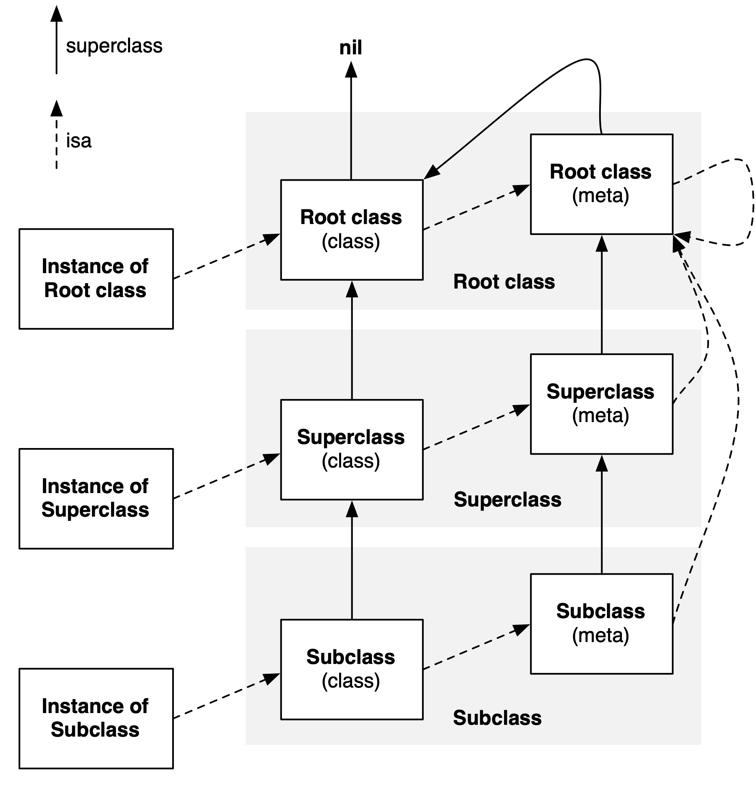
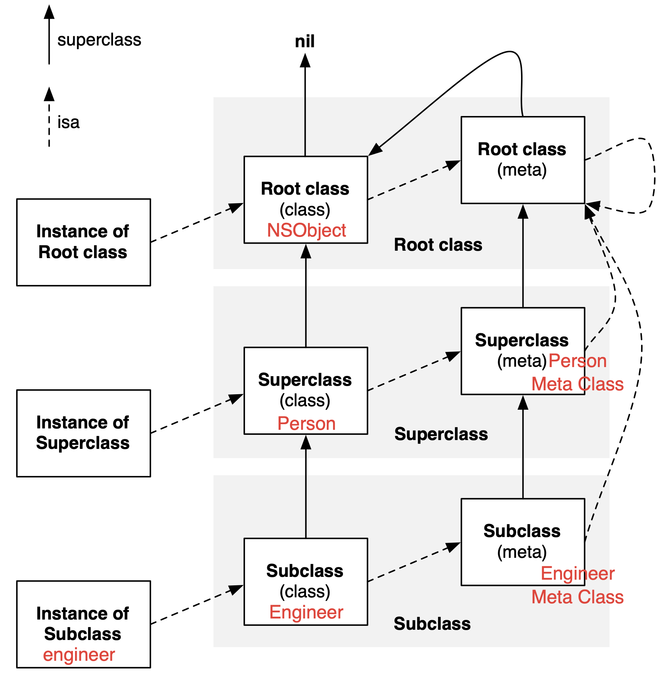

Objective-C 语言尽可能将决策从编译时间、链接时间推迟到运行时。只要有可能，它就会动态地执行任务。这意味着 Objective-C 不仅需要编译器，还需要运行时系统（runtime system）执行编译的代码。Objective-C 的动态性就是由 runtime 来支撑和实现的。

借助 runtime 可以实现很多功能，如字典转模型（MJExtension），查看私有成员变量，替换方法实现（method swizzling），为分类增加属性（associated objects）等。[JSPatch](https://github.com/bang590/JSPatch)热更新也是利用了 runtime，以便实现动态添加、改变方法实现。

关于 Objective-C runtime 的内容有很多，这里将分两篇文章介绍。本篇文章涉及内容如下：

- Runtime 预览
- 对象和类
  - 对象 object
  - 类 Class
  - 元类 meta class
  - Method
- 消息发送

## 1. Runtime 预览

Runtime API 提供的接口基本都是 C 语言的，源码由C、C++、汇编语言编写。Runtime 库为 C 语言添加了动态功能，还添加了使面向对象（object-oriented programming，简称OOP）成为可能的所有支持。

#### 1.1 动态、静态语言 Dynamic vs Static Language

Objective-C 是一种动态语言（dynamic language），它尽可能将决策从编译时间、链接时间推迟到运行时。

这一点与静态语言（如 C 语言）不同。在 C 语言中，调用函数意味着跳转到内存特定位置，其在编译时已经决定。因此，与诸如 Objective-C 这样的动态语言相比，灵活性要差很多。

先看下面代码：

```
    Engineer *engineer = [[Engineer alloc] initWithName:@"pro648"];
    
    [engineer sayHi];
    // compiler translates above line to:
    objc_msgSend(engineer, @selector(sayHi));
```

有一个名称为`Engineer`的类，调用`sayHi`方法。`sayHi`方法的实现并不会立即执行，编译器会将其转换为 C 语言的函数调用。`objc_msgSend()`函数向`engineer`实例对象发送消息，Objective-C 对象可能无法处理该消息，当无法处理时，会进入动态方法解析（dynamic method resolution）、消息转发（message forwarding）阶段。

> Objective-C 中的方法调用都是转成`objc_msgSend`函数调用，给 receiver（方法调用者）发送一条消息（selector方法名）。

#### 1.2 与 Runtime 交互

在没有意识到的情况下已经在使用 runtime。从开始编写 iOS、macOS 程序起，我们就被告知需要继承自`NSObject`。这是因为许多麻烦的功能（如内存管理）都集成在`NSObject`中。只要使用`NSObject`的子类，就会自动获得这些基础功能。

第二种与 runtime 交互的情况是调用 runtime 函数。大多数时候，我们不需要使用 runtime 函数，但 runtime 有时可以帮我们解决一些棘手的问题。导入`<objc/runtime.h>`即可使用 runtime。

## 2. 对象和类

在面向对象的程序中，类（class）是可扩展的代码模版，是逻辑和数据的抽象；对象（object）是 class 的特定实例。下面将介绍 Objective-C 中对象和类的表示方式。

#### 2.1 对象 Object

在 Objective-C 中，object 定义如下：

```
/// Represents an instance of a class.
struct objc_object {
    Class _Nonnull isa  OBJC_ISA_AVAILABILITY;
};

/// A pointer to an instance of a class.
typedef struct objc_object *id;
```

可以看到，每个对象是一个结构体，结构体包含一个 isa 指针，isa 指针指向类对象。这里还定义了通用类型的`id`，它是一个指向`objc_object`的指针。

#### 2.2 类 Class

Objective-C 是一个基于类的对象系统。每个对象都是某个类的实例，对象的`isa`指针指向类。类描述对象的数据：分配大小、ivar类型和布局。类还会描述对象的行为，如对象可以响应的选择器以及实现的实例方法。

`Class`是指向`objc_class`结构体的指针。

```
/// An opaque type that represents an Objective-C class.
typedef struct objc_class *Class;
```

`objc_class`结构体如下：

```
struct objc_class {
    Class _Nonnull isa  OBJC_ISA_AVAILABILITY;

#if !__OBJC2__
    Class _Nullable super_class                              OBJC2_UNAVAILABLE;
    const char * _Nonnull name                               OBJC2_UNAVAILABLE;
    long version                                             OBJC2_UNAVAILABLE;
    long info                                                OBJC2_UNAVAILABLE;
    long instance_size                                       OBJC2_UNAVAILABLE;
    struct objc_ivar_list * _Nullable ivars                  OBJC2_UNAVAILABLE;
    struct objc_method_list * _Nullable * _Nullable methodLists                    OBJC2_UNAVAILABLE;
    struct objc_cache * _Nonnull cache                       OBJC2_UNAVAILABLE;
    struct objc_protocol_list * _Nullable protocols          OBJC2_UNAVAILABLE;
#endif

} OBJC2_UNAVAILABLE;
/* Use `Class` instead of `struct objc_class *` */
```

###### 2.2.1 isa

对比`objc_object`和`objc_class`结构体，会发现结构体第一个成员都是`isa`指针。这表明 Objective-C 中类本质上也是一个对象。

这意味着可以将消息发送给类对象，就像发送给实例对象一样。当给实例对象发送消息时，runtime 会查询其类对象是否可以响应该消息。`objc_class`结构体中的`objc_method_list`包含了方法列表，这使添加、移除、交换方法得以实现。

> 在arm64架构之前，isa就是普通指针，直接存储类对象、元类对象地址值。arm64架构开始，对isa进行了优化，变成了共用体（union）结构，使用位域来存储更多的信息。

###### 2.2.2 super_class

`super_class`指针指向父类。如果它已经是最顶级的类（如`NSObject`、`NSProxy`），则`super_class`指针为`NULL`。

在消息传递时，如果在当前类找不到该方法，会根据`super_class`指针进入父类查找。

###### 2.2.3 objc_cache

向实例对象发送消息时，runtime 根据`isa`指针找到类对象，然后在类对象`objc_method_list`中查找；如果找不到方法，继续在父类`objc_method_list`中查找，直到找到方法或查找失败。如果每次都需要进行这样的查找，会非常耗时。

```
struct objc_cache {
    unsigned int mask /* total = mask + 1 */                 OBJC2_UNAVAILABLE;
    unsigned int occupied                                    OBJC2_UNAVAILABLE;
    Method _Nullable buckets[1]                              OBJC2_UNAVAILABLE;
};
```

为了提高查找性能，runtime 使用哈希表存储了当前类已经查找过的方法。使用`selector` & mask做为 key，将`selector`存储到`buckets`中。不同方法 & mask 后可能产生相同 key。如果遇到已经被占用，其会减一再次尝试，直到循环到初次计算出的位置。取方法时，取出后会先比较`selector`。如果不同，key减一再次比较。哈希表用空间换时间，牺牲内存提高效率。

```
static void cache_fill_nolock(Class cls, SEL sel, IMP imp, id receiver)
{
    cacheUpdateLock.assertLocked();

    // Never cache before +initialize is done
    if (!cls->isInitialized()) return;

    // Make sure the entry wasn't added to the cache by some other thread 
    // before we grabbed the cacheUpdateLock.
    if (cache_getImp(cls, sel)) return;

    cache_t *cache = getCache(cls);
    cache_key_t key = getKey(sel);

    // Use the cache as-is if it is less than 3/4 full
    mask_t newOccupied = cache->occupied() + 1;
    mask_t capacity = cache->capacity();
    if (cache->isConstantEmptyCache()) {
        // Cache is read-only. Replace it.
        cache->reallocate(capacity, capacity ?: INIT_CACHE_SIZE);
    }
    else if (newOccupied <= capacity / 4 * 3) {
        // Cache is less than 3/4 full. Use it as-is.
    }
    else {
        // Cache is too full. Expand it.
        cache->expand();
    }

    // Scan for the first unused slot and insert there.
    // There is guaranteed to be an empty slot because the 
    // minimum size is 4 and we resized at 3/4 full.
    bucket_t *bucket = cache->find(key, receiver);
    if (bucket->key() == 0) cache->incrementOccupied();
    bucket->set(key, imp);
}
```

最终，发送消息时，类会先查找`cache_t`是否存在该方法。如果存在，则直接调用；如果不存在，首先进入`objc_method_list`查找；如果找到，调用该方法并添加到当前类的`cache_t`；如果找不到，则根据`super_class`指针，进入父类查找，这里也会先在`cache_t`查找。如果找到，调用该方法并添加到消息接受者类的`cache_t`（不是父类的`cache_t`）。依此类推，直到找到该方法，或根类也找不到，进入方法动态解析阶段。

#### 2.3 元类 meta class

Objective-C 的 class 也是一个对象，有`isa`指针和其他数据，可以响应 selector。当调用`[NSObject alloc]`类似的类方法时，本质上是向类对象发送消息。

类是元类（metaclass）的实例。metaclass 是类对象的描述，就像类是对实例对象的描述。类对象的`isa`指针指向元类。metaclass 的 method list 包含类方法，当向类对象发送消息时，`objc_msgSend()`根据 metaclass（和其父类） 的 method list 查找方法实现。

类对象描述实例对象的行为，元类描述类对象的行为。

###### meta-meta class？

你或许会想 meta class 的`isa`指针指向哪里？是否有元类的元类？

为避免这种无限递归，Objective-C 的创建者让所有元类的`isa`指针指向根元类，根元类的`isa`指针指向自身。

现在，已经对类结构有了完整的了解。Runtime 工程师 [Greg Parker](http://www.sealiesoftware.com/blog/archive/2009/04/14/objc_explain_Classes_and_metaclasses.html) 在他的博客贴了张非常清晰的图表，如下：



metaclass 的父类与类的父类链条平行。因此，查找类方法与查找实例方法类似。

root meta class 的父类是 root class。因此，层级结构中的所有实例、类、元类都将继承自基类，root class 的实例方法对所有实例、类、元类均有效。root class 的类方法对所有类、元类都有效。

下面是两个简单的类，`Person`继承自`NSObject`，`Engineer`继承自`Person`。在`Engineer`类实现了一些方法，`testMetaClass`方法查找`isa`指针指向并输出；`testSuperClass`方法查找`super_class`指针指向并输出：

```
- (void)testMetaClass {
    NSLog(@"----- %s -----", __func__);
    NSLog(@"This object is %p", self);
    NSLog(@"Class is %@, and super is %@.", [self class], [self superclass]);
    
    Class currentClass = [self class];
    for (int i=0; i<4; ++i) {
        NSLog(@"Following the isa pointer %d times gives %p", i+1, currentClass);
        currentClass = object_getClass(currentClass);
    }
    
    // 不能通过[Person class]获得元类
    NSLog(@"NSObject's meta class is %p", object_getClass([NSObject class]));
}

- (void)testSuperClass {
    NSLog(@"----- %s -----", __func__);
    NSLog(@"This object is %p.", self);
    NSLog(@"Class is %@, and super is %@.", [self class], [self superclass]);
    
    Class currentClass = [self class];
    Class currentMetaClass = object_getClass(currentClass);
    for (int i=0; i<4; ++i) {
        NSLog(@"Following the super pointer %d times gives %p", i+1, currentClass);
        currentClass = class_getSuperclass(currentClass);
    }
    
    for (int i=0; i<5; ++i) {
        NSLog(@"Following the meta class super pointer %d times gives %p", i+1, currentMetaClass);
        currentMetaClass = class_getSuperclass(currentMetaClass);
    }
    
    NSLog(@"NSObject's meta class is %p", object_getClass([NSObject class]));
}
```

执行以下代码：

```
    Engineer *engineer = [[Engineer alloc] initWithName:@"pro648"];
    
    [engineer testMetaClass];
    [engineer testSuperClass];
```

输出如下：

```
----- -[Engineer testMetaClass] -----
This object is 0x6000037b7950
Class is Engineer, and super is Person.
Following the isa pointer 1 times gives 0x10f7956c0
Following the isa pointer 2 times gives 0x10f7956e8
Following the isa pointer 3 times gives 0x1100de1d8
Following the isa pointer 4 times gives 0x1100de1d8
NSObject's meta class is 0x1100de1d8

----- -[Engineer testSuperClass] -----
This object is 0x6000037b7950.
Class is Engineer, and super is Person.
Following the super pointer 1 times gives 0x10f7956c0
Following the super pointer 2 times gives 0x10f795648
Following the super pointer 3 times gives 0x1100de200
Following the super pointer 4 times gives 0x0
Following the meta class super pointer 1 times gives 0x10f7956e8
Following the meta class super pointer 2 times gives 0x10f795620
Following the meta class super pointer 3 times gives 0x1100de1d8
Following the meta class super pointer 4 times gives 0x1100de200
Following the meta class super pointer 5 times gives 0x0
NSObject's meta class is 0x1100de1d8
```

指针指向的具体地址并不重要，但可跟踪`isa`指向。

`engineer`实例内存地址是`0x6000037b7950`，它的类对象地址是`0x10f7956c0`，它的元类地址是`0x10f7956e8`，root meta class 地址是`0x1100de1d8`，root meta class 的`isa`指针指向自身。



通过`testSuperClass`方法的输出，可以跟踪`super_class`层级结构。root meta class 的 super class 是`0x1100de200`，也就是`NSObject`类对象。`NSObject`的父类是`NULL`。

#### 3. Method

类的方法列表是实例对象方法的集合。当向实例对象发送消息时，`objc_msgSend()`在其类对象（和类对象的父类）的`objc_method_list`中查找方法。

`objc_method_list`结构体中包含`objc_class`的方法：

```
struct objc_method_list {
    struct objc_method_list * _Nullable obsolete             OBJC2_UNAVAILABLE;

    int method_count                                         OBJC2_UNAVAILABLE;
#ifdef __LP64__
    int space                                                OBJC2_UNAVAILABLE;
#endif
    /* variable length structure */
    struct objc_method method_list[1]                        OBJC2_UNAVAILABLE;
}                                                            OBJC2_UNAVAILABLE;
```

`objc_method`结构体如下：

```
struct objc_method {
    SEL _Nonnull method_name                                 OBJC2_UNAVAILABLE;
    char * _Nullable method_types                            OBJC2_UNAVAILABLE;
    IMP _Nonnull method_imp                                  OBJC2_UNAVAILABLE;
}                                                            OBJC2_UNAVAILABLE;
```

`objc_method`结构体包含`method_name`、`method_types`和`method_imp`。

###### 3.1 SEL

在 Objective-C 中，selector 是一个 C 的数据结构，可以把它看作是方法的 id。在 runtime 中定义如下：

```
/// An opaque type that represents a method selector.
typedef struct objc_selector *SEL;
```

`object_selector`是不透明类型，可以把它当作方法名称，但 runtime 不是直接存储方法名称，而是将其映射为层级结构中唯一的字符串。这也是为什么类中不能有名称相同、参数类型不同的方法。

###### 3.2 IMP

`IMP`指针指向函数的实现：

```
typedef id _Nullable (*IMP)(id _Nonnull, SEL _Nonnull, ...); 
```

如果将 signature 与`objc_msgSend`进行比较，会发现其实际上是相同的。其参数都包含一个对象、一个 selector，外加可变数量的参数。按照约定，runtime 将`self`作为第一个参数传递，将当前 selector 作为第二个参数传递。

这就是为什么可以在方法内调用`self`和`_cmd`，以及添加 C 函数时，需要添加`self`、`_cmd`参数。

###### 3.3 Method Type

`method_types`存储方法返回值类型、参数类型，runtime 将这些信息编码为一个字符串。具体规则可以查看[Type Encodings](https://developer.apple.com/library/archive/documentation/Cocoa/Conceptual/ObjCRuntimeGuide/Articles/ocrtTypeEncodings.html)文档。

也可以通过`@encode`指令获取编码后的字符。例如：

```
    char *intTypeCode = @encode(int);
    char *voidTypeCode = @encode(void);
    
    NSLog(@"int: %s, void:%s",intTypeCode, voidTypeCode);
```

输出如下：

```
int: i, void:v
```

## 3. 消息发送

结合前面的介绍，我们已经知道 runtime 如何发送消息：

1. 根据实例对象的`isa`指针找到类对象。

2. 类对象的消息解析：

   1. 查看类对象的`cache_t`是否存在该方法。如果存在，直接调用；如果不存在，进入下一步。
   2. 查看类对象`objc_method_list`是否有该方法。如果存在，调用并添加到`cache_t`；如果不存在，进入下一步。
   3. 查看父类的`cache_t`是否存在该方法。如果存在，调用并添加到消息接收者的`cache_t`；如果不存在，进入下一步。
   4. 查看类对象`objc_method_list`是否有该方法。如果存在，调用并添加到消息接收者`cache_t`；如果不存在，进入下一步。
   5. 以此类推，直到找到根类。

   > 如果在3、4及其他父类中找到该方法，会将其添加到消息接收者的`cache_t`，即 receiver 的`cache_t`。

3. 动态方法解析。

4. 消息转发。

下一篇文章[Runtime从入门到进阶二](https://github.com/pro648/tips/wiki/Runtime%E4%BB%8E%E5%85%A5%E9%97%A8%E5%88%B0%E8%BF%9B%E9%98%B6%E4%BA%8C)将介绍动态方法解析、消息转发，以及runtime在项目中的具体应用。

Demo名称：Runtime  
源码地址：<https://github.com/pro648/BasicDemos-iOS/tree/master/Runtime>

参考资料：

1. [[objc explain] - Non-pointer isa](http://www.sealiesoftware.com/blog/archive/2013/09/24/objc_explain_Non-pointer_isa.html)
2. [[objc explain] - Classes and metaclasses ](http://www.sealiesoftware.com/blog/archive/2009/04/14/objc_explain_Classes_and_metaclasses.html)
3. [Greg Parker objc](https://news.ycombinator.com/from?site=sealiesoftware.com)
4. [Digging Into the Objective-C Runtime - Part I](https://engineering.seagroup.com/digging-into-objective-c-runtime/)
5. [Understanding the Objective-C Runtime](https://cocoasamurai.blogspot.com/2010/01/understanding-objective-c-runtime.html)