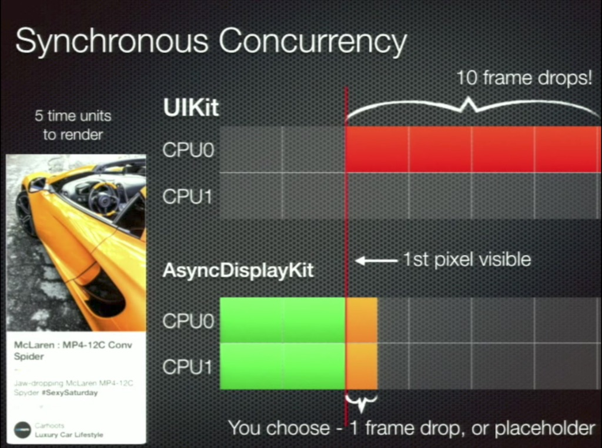
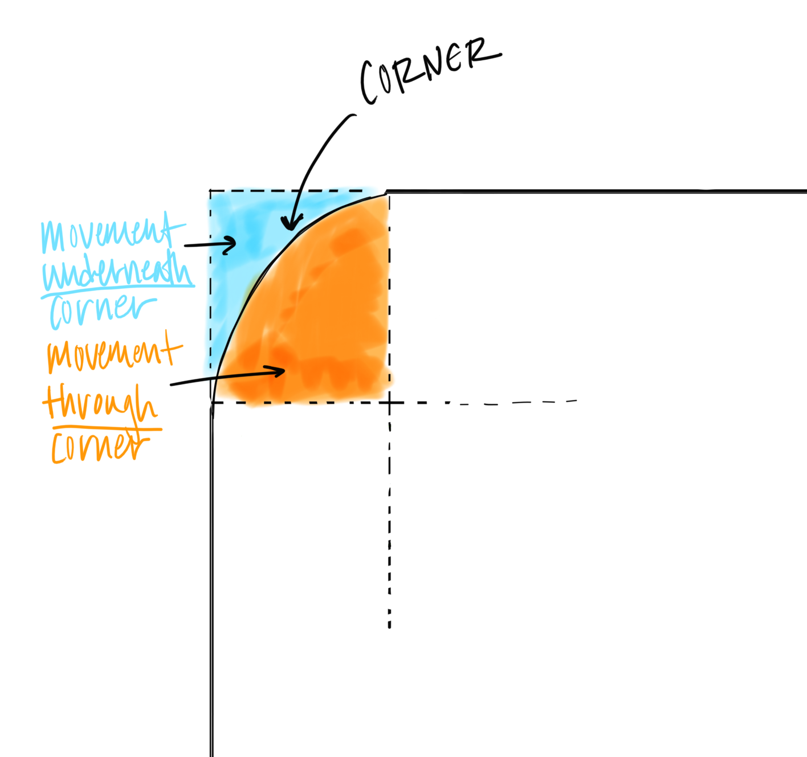
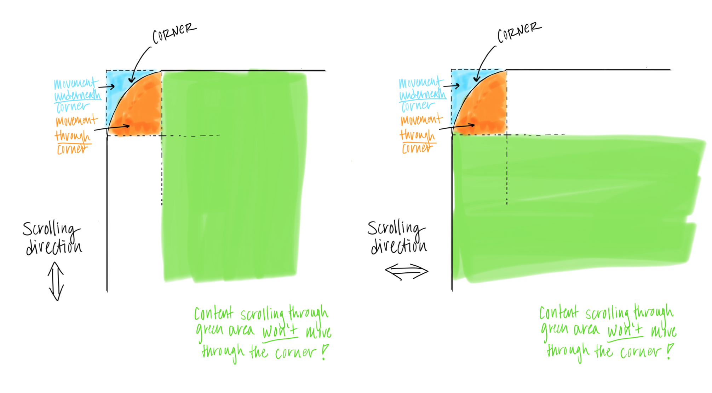
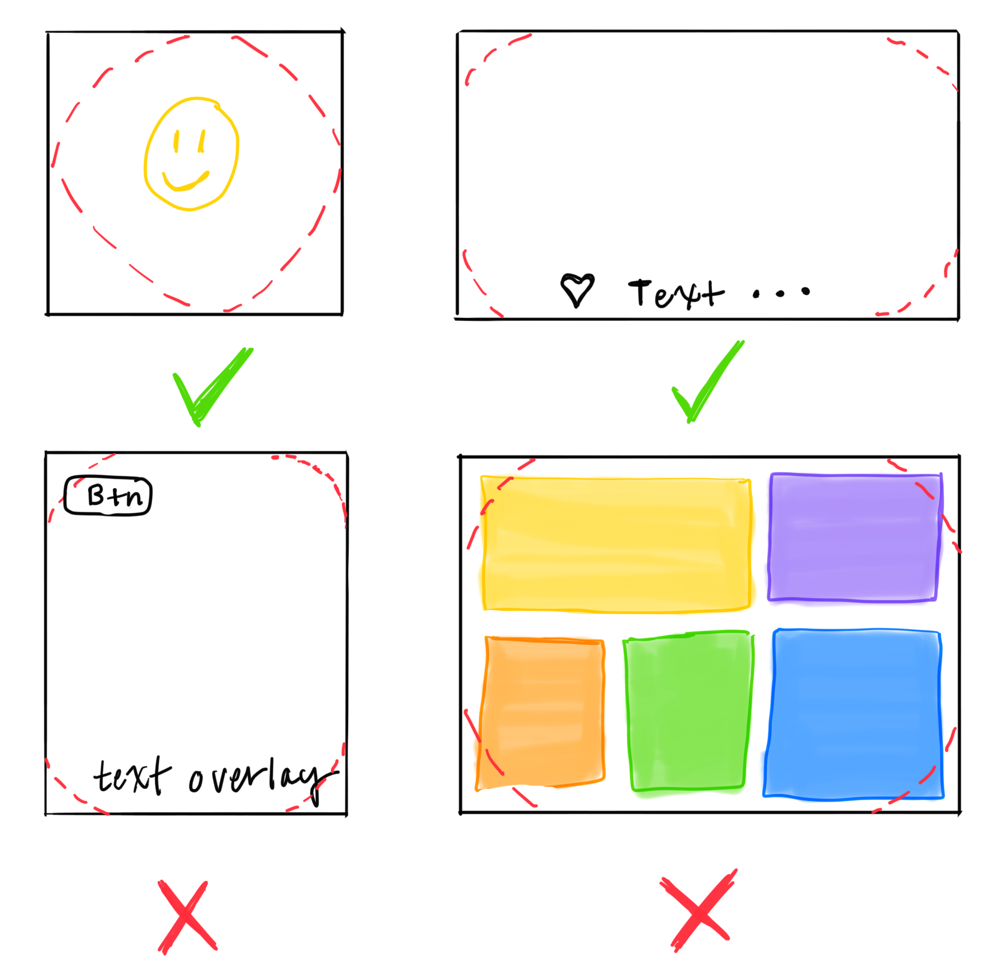
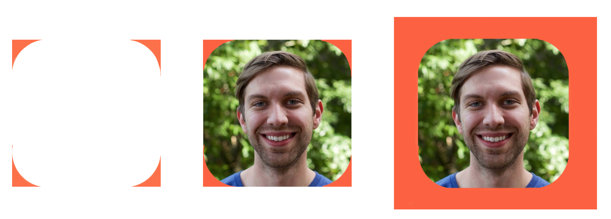
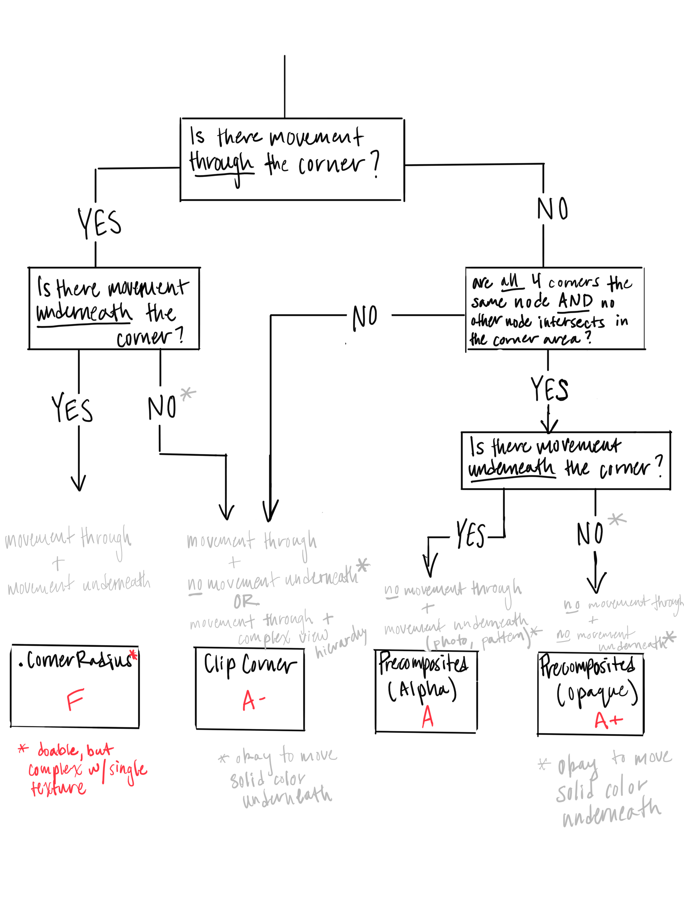

> 这是 Texture 文档系列翻译，其中结合了自己的理解和工作中的使用体会。如果哪里有误，希望指出。
>
> 1. [Texture 核心概念](https://github.com/pro648/tips/wiki/Texture%20%E6%A0%B8%E5%BF%83%E6%A6%82%E5%BF%B5)
>
> 2. [Texture 布局 Layout](https://github.com/pro648/tips/wiki/Texture%20%E5%B8%83%E5%B1%80%20Layout)
>
> 3. [Texture 便捷方法](https://github.com/pro648/tips/wiki/Texture%20%E4%BE%BF%E6%8D%B7%E6%96%B9%E6%B3%95)
>
> 4. [Texture 性能优化](https://github.com/pro648/tips/wiki/Texture%20%E6%80%A7%E8%83%BD%E4%BC%98%E5%8C%96)
>
> 5. [Texture 容器 Node Containers](https://github.com/pro648/tips/wiki/Texture%20%E5%AE%B9%E5%99%A8%20Node%20Containers)
>
> 6. [Texture 基本控件 Node](https://github.com/pro648/tips/wiki/Texture%20%E5%9F%BA%E6%9C%AC%E6%8E%A7%E4%BB%B6%20Node)
> 7. [Texture 中 Node 的生命周期](https://github.com/pro648/tips/wiki/Texture%20%E4%B8%AD%20Node%20%E7%9A%84%E7%94%9F%E5%91%BD%E5%91%A8%E6%9C%9F)

## Layer Backing

通过使用 layer 而非 view 可以显著提高 app 性能，推荐在不需要触摸事件的 node 中开启 layer-backing。

在`UIKit`中，手动将基于视图的代码转换为 layer 很费力，并且在需要启用触摸处理或其他特定于视图的功能时，需要手动将所有内容转换回去。

在 Texture 中，将 node 的视图及所有 subtree 转换为 layer 非常简单：

```
rootNode.isLayerBacked = YES;
```

需要转换回 view 时，只需删除这一行。

## 子树栅格化 Subtree Rasterization

将整个视图层级合成为一个图层可以提高性能，但在`UIKit`中会影响可维护性和基于层级结构的推理。

在 node 中，开启合成非常简单：

```
[rootNode enableSubtreeRasterization];
```

上述代码使从 rootNode 开始整个 node 层次结构合成为一层。

## 同步并发 Synchronous Concurrency

`ASViewController`和`ASCellNode`都有一个布尔类型`neverShowPlaceholders`属性。通过将此属性设置为`YES`，cell 或视图控制器的 view 绘制完成前主线程将被堵塞。

开启该属性后，并不能充分利用 Texture 的性能。通常 node 已被预加载，在进入屏幕时即将完成，因此堵塞时间很短。即使`rangeTuningParameters`设置为0，Texture 性能也优于`UIKit`。因为即使主线程堵塞，subnode 也在并发执行。

查看[NSSpain 2015 talk video](https://www.youtube.com/watch?v=RY_X7l1g79Q&t=22m30s)了解其具体行为：

```
node.neverShowPlaceholders = YES;
```

通常，cell 绘制完成前进入了屏幕会显示占位符，直到绘制完成。将`neverShowPlaceholders`设置为`YES`使 Texture 更像`UIKit`，即滑动时会像`UIKit`一样掉帧，尽管 Texture 速度会快些。



## 圆角 Corner Rounding

对于圆角处理，很多开发人员都会选择`CALayer`的`cornerRadius`属性。但`cornerRadius`会严重影响性能，应在没有其他选择时才使用。这一部分将涵盖：

- 为何不应使用`CALayer`的`cornerRadius`。
- 其他更为高效实现圆角方式，以及何时使用。
- 选择圆角处理的流程图。
- Texture 实现圆角的方法。

#### CALayer 的 cornerRadius 耗费性能

使用`CALayer`的`cornerRadius`会触发离屏渲染（offscreen rendering），以在每帧上执行裁剪操作。滚动时每秒需要在60帧上执行裁剪操作，即使内容没有发生任何变化。这意味着 GPU 必须在每帧之间切换上下文，包括合成整个帧和裁剪。

这些对性能的消耗不会显示在 Time Profiler 中，因为其影响的是 CoreAnimation Render Server，会造成掉帧。

#### 圆角策略

当选择圆角策略时，只需考虑以下三点：

1. 圆角下（movement underneath the corner）是否有滑动。
2. 是否有穿过圆角滑动（movement through the corner）。
3. 四个圆角是否处于同一个 node 上，有没有与其他 node 相交。

圆角下滑动是指圆角后面的任何运动。例如，当一个圆角 cell 在背景上滚动时，背景就是在圆角下滑动。

为了描述穿过圆角滑动，可以想象一个小的圆角滚动视图，其中包含大很多的图片。当在滚动视图内缩放、平移图片时，照片将在滚动视图的各个角中穿过。



上图中，蓝色表示圆角下有滑动；橙色表示穿过圆角滑动。

> 圆角对象内部有移动，而无需移过角。下图显示了以绿色标志的内容，该内容从边缘开始插入，其边距等于圆半径大小。当内容滚动时，它不会在角落滚动。



使用上述方法来调整设计以消除圆角移动的影响，以便不影响性能的情况下使用`cornerRadius`。

最后需要注意是否四个角处于同一个 node 中，或 subnode 与圆角相交。



#### 预合成角 Precomposited Corners

预合成角指使用贝塞尔曲线绘制角的曲线，以在 CGContext / UIGraphicsContext 中剪切内容。在这种情况下，拐角将成为图像本身的一部分，并被同步到`CALayer`中，有两种类型的预合成角：

最佳方案为使用预合成的不透明角（precomposited opaque corner），这是最高效的方法，可实现零 alpha 混合（尽管这比避免触发屏外渲染的重要性小很多），但其不够灵活。如果圆角的对象需要移动，则后面的背景将需要为纯色。使用 Texture 或图片背景会很棘手，推荐使用预合成的 alpha 角。

第二种涉及贝塞尔曲线的角是预合成 alpha 角（precomposited alpha corner），此方法非常灵活，是最常用的方法之一。其会增加在这个内容上进行 alpha 混合的成本，并且 alpha 通道不透明会增加25%内存消耗，但这些消耗对于现代设备来说很小，与`cornerRadius`触发的离屏渲染不在同一数量级。

预合成角要求角必须在同一 node，且不与 subnode 相交。不满足任一条件，则需使用裁剪圆角。

当使用了`shouldRasterizeDescendants`后，Texture 会自动对`cornerRadius`进行预合成。在开启栅格化前，请务必仔细考虑，具体可以查看[子树栅格化 Subtree Rasterization](https://github.com/pro648/tips/wiki/Texture%20%E6%80%A7%E8%83%BD%E4%BC%98%E5%8C%96#子树栅格化-Subtree-Rasterization)

> Texture 的`UIImage+ASConveniences.h`提供了简单、纯色圆角实现方法，支持 alpha 和不透明创建平面颜色，圆角可以调整大小，非常适合于图像 node 和`ASButtonNode`的背景占位符。

#### 剪裁圆角 Clip Corner

Clip corner 通过向四个角放置四个不透明内容实现圆角。这种方法灵活、性能高。四个单独 layer 对于 CPU 来说性能消耗很少。



Clip Corner 适用于以下两种情况：

- 四个角在不同 node，或与 subnode 相交。
- 圆角只在 node 顶部。

#### 是否可以使用CALayer的cornerRadius

虽然很少、但也存在必须使用`cornerRadius`的情况。例如，在实现动画时，圆角下滑动、穿过圆角的内容是动态的，但通常可以通过改变设计利用前面的解决方案。

屏幕没有任何滑动时，使用`cornerRadius`对性能的影响小很多。只要屏幕有滑动，即使不涉及圆角部分，也会因使用`cornerRadius`对性能产生影响。例如，导航栏中有一个圆形元素，其下方有滚动视图，即使它们不重叠，也会产生影响。滑动屏幕上任何内容，均会对性能产生影响，即使用户没有与其交互。此外，任何类型的屏幕刷新，都将因`cornerRadius`而产生额外开销。

#### Rasterization 和 Layerbacking

虽然使用`CALayer`的`shouldRasterize`可以提高`cornerRadius`的性能，但这是一个未充分理解的选项，通常很危险。在无需重新栅格化时（即没有滑动、点击更改颜色，也不在移动的表视图上），可以使用`shouldRasterize`属性。通常，不建议使用`shouldRasterize`，其可能会导致更为严重的性能下降。对于本身性能不佳、坚持使用`cornerRadius`属性的app来说，其能够带来一定的性能提升。但如果正从零构建一款 app，强烈建议选择前面更好的圆角策略。

`CALayer`的`shouldRasterize`与 Texture 的`node.shouldRasterizeDescendents`无关，当开启`shouldRasterizeDescendents`后，将阻止 subnode 创建 view 和 layer。

#### 圆角策略选取

使用下面流程图选取合适圆角策略：



#### Texture 实现圆角的方式

在 Texture 中，有以下几种实现圆角的方式。

###### 使用 cornerRadius

```
CGFloat cornerRadius = 20.0;
    
_photoImageNode.cornerRoundingType = ASCornerRoundingTypeDefaultSlowCALayer;
_photoImageNode.cornerRadius = cornerRadius;
```

###### 使用 precomposition

```
CGFloat cornerRadius = 20.0;
    
_photoImageNode.cornerRoundingType = ASCornerRoundingTypePrecomposited;
_photoImageNode.cornerRadius = cornerRadius;
```

使用 clipping

```
CGFloat cornerRadius = 20.0;

_photoImageNode.cornerRoundingType = ASCornerRoundingTypeClipping;
_photoImageNode.backgroundColor = [UIColor whiteColor];
_photoImageNode.cornerRadius = cornerRadius;
```

###### 使用 willDisplayNodeContentWithRenderingContext 设置裁剪路径

```
CGFloat cornerRadius = 20.0;
    
// Use the screen scale for corner radius to respect content scale
CGFloat screenScale = UIScreen.mainScreen.scale;
_photoImageNode.willDisplayNodeContentWithRenderingContext = ^(CGContextRef context, id drawParameters) {
    CGRect bounds = CGContextGetClipBoundingBox(context);
    CGFloat radius = cornerRadius * screenScale; 
    UIImage *overlay = [UIImage as_resizableRoundedImageWithCornerRadius:radius
                                                             cornerColor:[UIColor clearColor]
                                                               fillColor:[UIColor clearColor]];
    [overlay drawInRect:bounds];
    [[UIBezierPath bezierPathWithRoundedRect:bounds cornerRadius:radius] addClip];
};
```

###### 使用 ASImageNode 获取圆形图像并添加边框

非常适合于获取圆形头像。

```
CGFloat cornerRadius = 20.0;

_photoImageNode.imageModificationBlock = ASImageNodeRoundBorderModificationBlock(5.0, [UIColor orangeColor]);
```

> 上一篇：[Texture 便捷方法](https://github.com/pro648/tips/wiki/Texture%20%E4%BE%BF%E6%8D%B7%E6%96%B9%E6%B3%95)
>
> 下一篇：[Texture 容器 Node Containers](https://github.com/pro648/tips/wiki/Texture%20%E5%AE%B9%E5%99%A8%20Node%20Containers)