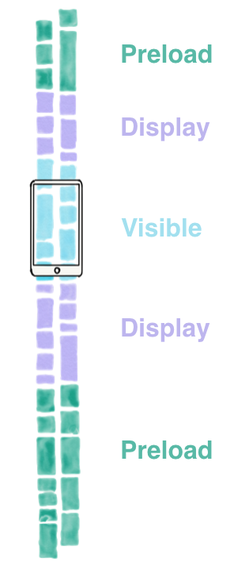
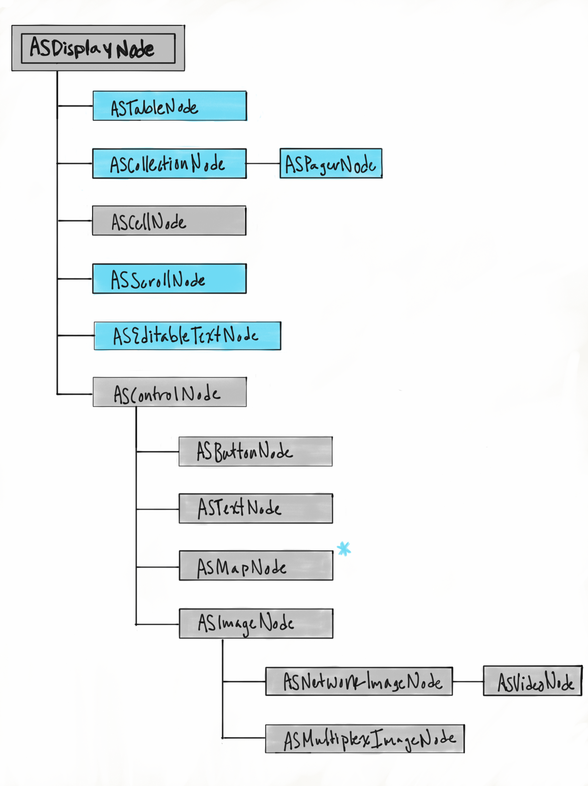

> 这是 Texture 文档系列翻译，其中结合了自己的理解和工作中的使用体会。如果哪里有误，希望指出。
>
> 1. [Texture 核心概念](https://github.com/pro648/tips/wiki/Texture%20%E6%A0%B8%E5%BF%83%E6%A6%82%E5%BF%B5)
>
> 2. [Texture 布局 Layout](https://github.com/pro648/tips/wiki/Texture%20%E5%B8%83%E5%B1%80%20Layout)
>
> 3. [Texture 便捷方法](https://github.com/pro648/tips/wiki/Texture%20%E4%BE%BF%E6%8D%B7%E6%96%B9%E6%B3%95)
>
> 4. [Texture 性能优化](https://github.com/pro648/tips/wiki/Texture%20%E6%80%A7%E8%83%BD%E4%BC%98%E5%8C%96)
>
> 5. [Texture 容器 Node Containers](https://github.com/pro648/tips/wiki/Texture%20%E5%AE%B9%E5%99%A8%20Node%20Containers)
>
> 6. [Texture 基本控件 Node](https://github.com/pro648/tips/wiki/Texture%20%E5%9F%BA%E6%9C%AC%E6%8E%A7%E4%BB%B6%20Node)
> 7. [Texture 中 Node 的生命周期](https://github.com/pro648/tips/wiki/Texture%20%E4%B8%AD%20Node%20%E7%9A%84%E7%94%9F%E5%91%BD%E5%91%A8%E6%9C%9F)

Texture是一个UI框架，最初诞生于Facebook的Paper app。通过使 UI 相关操作线程安全来优化app，这意味着能够将所有昂贵视图相关操作转移到后台线程，在显示前进行前期准备。

> [Texture](https://github.com/TextureGroup/Texture)之前名称为[AsyncDisplayKit](https://github.com/facebookarchive/AsyncDisplayKit)。

Texture 的基本单位是`node`。`ASDisplayNode`是对`UIView`的抽象，进而也是对`CALayer`的抽象。`node`是线程安全的，因此可以在后台并行处理。

为了保持用户界面流畅和响应速度，app需要以60帧 (frame) 每秒速度绘制，即主线程需要在十六分之一秒绘制一帧，布局和绘制需要在16毫秒内完成，而且由于系统开销，代码通常只有不到十毫秒运行时间，超过这个时间就会导致掉帧。

Texture 使您可以将图片解码、文本大小计算和渲染，以及其他昂贵的 UI 操作从主线程中移除，以保持主线程可响应用户交互。

## 安装 Texture

可以通过 CocoaPods 或 Carthage 将 Texture 添加到项目中，如果使用 CocoaPods 添加，则将以下内容添加到 Podfile：

```
target 'TestVideo' do
  pod 'Texture'
end
```

> 如果你对 Cocoapods 还不了解，可以查看[CocoaPods的安装与使用](https://github.com/pro648/tips/wiki/CocoaPods%E7%9A%84%E5%AE%89%E8%A3%85%E4%B8%8E%E4%BD%BF%E7%94%A8)、[使用CocoaPods创建公开、私有pod](https://github.com/pro648/tips/wiki/%E4%BD%BF%E7%94%A8CocoaPods%E5%88%9B%E5%BB%BA%E5%85%AC%E5%BC%80%E3%80%81%E7%A7%81%E6%9C%89pod)这两篇文章。

## 核心概念

#### 智能预加载

Node 的异步、并发进行渲染和计算功能非常强大，但 Texture 的另一个至关重要的功能是智能预加载。

需要注意的是，node 需要在 node container 中使用才拥有上述优势。在 node container 之外使用几乎没有好处，这是因为所有 node 都具有其当前界面状态的概念。

`interfaceState`属性由`ASRangeController`不断更新，所有容器都在内部创建和维护`ASRangeController`对象。

在容器之外使用 node 时，将没有`ASRangeController`负责更新其状态。这种情况下，node 可能未收到任何提醒就已经显示在了屏幕上，此时渲染 node 会出现闪烁。

###### 界面状态改变 Interface State Ranges

将 node 添加到滚动或翻页视图时，其通常处于以下状态之一。这意味着，随着滚动视图的滚动，它们的界面状态将随着它们的移动而更新。



Node 将处于以下状态之一：

| 界面状态 | 介绍                                                         |
| -------- | ------------------------------------------------------------ |
| Preload  | 离可见范围最远。此时从外部资源加载内容，例如：从 API 或磁盘加载图片。 |
| Display  | 绘制。例如文本光栅化、图片解码等。                           |
| Visible  | 显示，至少需要有一像素。                                     |

如上图所示，collection view 正在向下滚动，前导方向范围大小比尾随方向大很多。如果用户更改滑动方向，则前导和尾随将动态交换，以使内存使用保持最佳状态。这样可以避免定义前导和尾随大小，也不必对用户不断变化的滚动方向做出反应。

此外，range controller 还会根据界面状态、滚动视图滑动方向、渲染引擎等自动调整当前的`ASLayoutRangeMode`：

```
/**
 * Each mode has a complete set of tuning parameters for range types.
 * Depending on some conditions (including interface state and direction of the scroll view, state of rendering engine, etc),
 * a range controller can choose which mode it should use at a given time.
 */
typedef NS_ENUM(NSInteger, ASLayoutRangeMode) {
  ASLayoutRangeModeUnspecified = -1,
  
  /**
   * Minimum mode is used when a range controller should limit the amount of work it performs.
   * Thus, fewer views/layers are created and less data is fetched, saving system resources.
   * Range controller can automatically switch to full mode when conditions change.
   */
  ASLayoutRangeModeMinimum = 0,
    
  /**
   * Normal/Full mode that a range controller uses to provide the best experience for end users.
   * This mode is usually used for an active scroll view.
   * A range controller under this requires more resources compare to minimum mode.
   */
  ASLayoutRangeModeFull,
  
  /**
   * Visible Only mode is used when a range controller should set its display and preload regions to only the size of their bounds.
   * This causes all additional backing stores & preloaded data to be released, while ensuring a user revisiting the view will
   * still be able to see the expected content.  This mode is automatically set on all ASRangeControllers when the app suspends,
   * allowing the operating system to keep the app alive longer and increase the chance it is still warm when the user returns.
   */
  ASLayoutRangeModeVisibleOnly,
  
  /**
   * Low Memory mode is used when a range controller should discard ALL graphics buffers, including for the area that would be visible
   * the next time the user views it (bounds).  The only range it preserves is Preload, which is limited to the bounds, allowing
   * the content to be restored relatively quickly by re-decoding images (the compressed images are ~10% the size of the decoded ones,
   * and text is a tiny fraction of its rendered size).
   */
  ASLayoutRangeModeLowMemory
};
```

处于不同状态时，预加载范围不同。如下所示：

```
+ (std::vector<std::vector<ASRangeTuningParameters>>)defaultTuningParameters
{
  auto tuningParameters = std::vector<std::vector<ASRangeTuningParameters>> (ASLayoutRangeModeCount, std::vector<ASRangeTuningParameters> (ASLayoutRangeTypeCount));

  tuningParameters[ASLayoutRangeModeFull][ASLayoutRangeTypeDisplay] = {
    .leadingBufferScreenfuls = 1.0,
    .trailingBufferScreenfuls = 0.5
  };

  tuningParameters[ASLayoutRangeModeFull][ASLayoutRangeTypePreload] = {
    .leadingBufferScreenfuls = 2.5,
    .trailingBufferScreenfuls = 1.5
  };

  tuningParameters[ASLayoutRangeModeMinimum][ASLayoutRangeTypeDisplay] = {
    .leadingBufferScreenfuls = 0.25,
    .trailingBufferScreenfuls = 0.25
  };
  tuningParameters[ASLayoutRangeModeMinimum][ASLayoutRangeTypePreload] = {
    .leadingBufferScreenfuls = 0.5,
    .trailingBufferScreenfuls = 0.25
  };

  tuningParameters[ASLayoutRangeModeVisibleOnly][ASLayoutRangeTypeDisplay] = {
    .leadingBufferScreenfuls = 0,
    .trailingBufferScreenfuls = 0
  };
  tuningParameters[ASLayoutRangeModeVisibleOnly][ASLayoutRangeTypePreload] = {
    .leadingBufferScreenfuls = 0,
    .trailingBufferScreenfuls = 0
  };

  // The Low Memory range mode has special handling. Because a zero range still includes the visible area / bounds,
  // in order to implement the behavior of releasing all graphics memory (backing stores), ASRangeController must check
  // for this range mode and use an empty set for displayIndexPaths rather than querying the ASLayoutController for the indexPaths.
  tuningParameters[ASLayoutRangeModeLowMemory][ASLayoutRangeTypeDisplay] = {
    .leadingBufferScreenfuls = 0,
    .trailingBufferScreenfuls = 0
  };
  tuningParameters[ASLayoutRangeModeLowMemory][ASLayoutRangeTypePreload] = {
    .leadingBufferScreenfuls = 0,
    .trailingBufferScreenfuls = 0
  };
  return tuningParameters;
}
```

> 智能预加载支持多种方向。

###### 界面状态回调

当滚动视图时，node 在范围内移动，并通过加载数据、渲染等方式做出适当反应。你的 node 子类可以通过实现相应的回调方法利用此机制。

```
// Visible Range
-didEnterVisibleState
-didExistVisibleState

// Display Range
-didEnterDisplayState
-didExitDisplayState

// Preload Range
-didEnterPreloadState
-didExitPreloadState
```

> 在实现这些回调方法时，需要先调用`super`。

#### 节点容器 Node Container

###### 在 node container 中使用 node

强烈推荐在 Texture 的 node container 中使用 node。Texture 提供以下容器：

| Texture Node Container   | 对应UIKit控件                                                |
| ------------------------ | ------------------------------------------------------------ |
| `ASCollectionNode`       | 代替`UIKit`中的`UICollectionView`                            |
| `ASPagerNode`            | 代替`UIKit`中的`UIPageViewController`                        |
| `ASTableNode`            | 代替`UIKit`中的`UITableView`                                 |
| `ASViewController`       | 代替`UIKit`中的`UIViewController`                            |
| `ASNavigationController` | 代替`UIKit`中的`UINavigationController`，实现了`ASVisibility`协议。 |
| `ASTabBarController`     | 代替`UIKit`中的`UITabBarController`，实现了`ASVisiblity`协议。 |

> [Texture 容器 Node Containers](https://github.com/pro648/tips/wiki/Texture%20%E5%AE%B9%E5%99%A8%20Node%20Containers)这篇文章会详细介绍。

###### 使用 node container 的好处

Node container 自动管理其 node 的智能预加载。这意味着所有 node 的布局计算、数据获取、解码和渲染将异步完成。这也是推荐在 node container 中使用 node 的原因。

也可以直接使用 node，但除非有显式调用，否则 node 会在出现到屏幕上时才开始渲染（与`UIKit`一样），这会导致性能下降和内容闪烁。

#### 节点子类 Node Subclasses

使用 node 而非`UIKit`组件的关键优势是所有 node 的布局、渲染均可在非主线程渲染，因此主线程可用于响应用户交互事件。

Texture 提供以下 node：

| Texture Node                                                 | 对应UIKit控件                                                |
| ------------------------------------------------------------ | ------------------------------------------------------------ |
| `ASDisplayNode`                                              | 代替`UIKit`中的`UIView`，也是 Texture 的根 node。<br>所有node 均继承自`ASDisplayNode`。 |
| `ASCellNode`                                                 | 代替`UITableViewCell`、`UICollectionViewCell`。<br>`ASCellNode`被用在`ASTableNode`、`ASCollectionNode`、`ASPagerNode`。 |
| `ASScrollNode`                                               | 代替`UIKit`中的`UIScrollView`。<br>该 node 用于创建包含其他 node 的可滚动区域。 |
| `ASEditableTextNode`<br>`ASTextNode`                         | 代替`UIKit`的`UITextView`。<br>代替`UIKit`的`UILabel`。      |
| `ASImageNode`<br>`ASNetworkImageNode`<br>`ASMultiplexImageNode` | 代替`UIKit`的`UIImageView`。                                 |
| `ASVideoNode`<br>`ASVideoPlayerNode`                         | 代替`AVFoundation`的`AVPlayerLayer`。                        |
| `ASControlNode`                                              | 代替`UIKit`的`UIControl`。                                   |
| `ASButtonNode`                                               | 代替`UIKit`的`UIButton`。                                    |
| `ASMapNode`                                                  | 代替`MKMapView`的`MKMapView`。                               |

尽管 node 与这些`UIKit`组件等效，但通常 Texture 的 node 提供了更高级的功能和便捷性。例如，`ASNetworkImageNode`会执行自动加载和缓存管理，还支持渐进式 jpeg 和 GIF。

> Texture 文档中的[AsyncDisplayKitOverview](https://github.com/texturegroup/texture/tree/master/examples/AsyncDisplayKitOverview)包含了上述 node 的基本实现。

Node 继承层级如下：



蓝色显示的 node 是对`UIKit`对应控件的封装。例如，`ASScrollNode`封装了`UIScrollView`，`ASCollectionNode`封装了`UICollectionView`。

> [Texture 基本控件 Node](https://github.com/pro648/tips/wiki/Texture%20%E5%9F%BA%E6%9C%AC%E6%8E%A7%E4%BB%B6%20Node)这篇文章会详细介绍上述 node。

## 子类化

创建子类时最重要的区别是创建`ASViewController`还是创建`ASDisplayNode`。这听起来很明显，但由于其差异很微妙，因此请务必牢记这一点。

#### ASDisplayNode

虽然子类化 node 类似于子类化`UIView`，但需要遵循一些准则，以确保充分发挥框架潜能，并确保节点的行为符合预期。

###### -init

使用 nodeBlocks 时，在后台线程上调用此方法。但由于 -init 方法完成前不能执行其他方法，因此在此方法中永远不需要使用锁。

要记住的最重要的事情是 -init 方法必须能够在任何队列上被调用。这意味着绝不能初始化任何`UIKit`对象、接触 node 的 view 或 layer。例如：`node.layer.X`或`node.view.X`。也不能添加任何手势识别器。这些应在 -didLoad 方法中执行。

###### -didLoad

此方法在概念上类似于`UIViewController`的 -viewDidLoad，只调用一次，且在 backing view 加载后调用。该方法在主线程中调用，适合于执行对`UIKit`的操作。例如：添加手势识别器，触摸视图、图层，初始化`UIKit`对象。

-layoutSpecThatFits:

此方法指定视图布局，并在后台线程进行计算。在此方法中构建布局规范对象，该对象将产生 node 及子 node 大小和位置。应将大部分布局代码放到 -layoutSpecThatFits 方法中。

在此方法返回前，布局规范对象可以延展（malleable up）。返回后，将不可变。不要缓存布局规范，应在每次需要时重新创建布局规范。

该方法在后台线程运行，不要在此方法内设置任何`node.view`或`node.layer`属性。另外，除非您知道自己在做什么，否则，不要在此方法中创建 node。-layoutSpecThatFits: 方法无需以调用 super 开始，这一点与其他方法不同。

###### -layout

在此方法中调用 super 时会将布局方案应用起来。在此方法中调用 super 之后，将立即计算布局，并测量、布局所有 subnode。

`layout`方法与`UIViewController`中的`viewWillLayoutSubview`方法类似。这是设置隐藏属性、设置基于视图的属性（非可布局属性）或设置背景颜色的好地方。可以将背景颜色设置放在`layoutSpecThatFits:`中，但可能存在时间问题。如果在使用`UIView`，则可以在此设置其 frame。另外，始终可以使用`initWithViewBlock:`创建 node，然后在其他位置的后台线程上调整其大小。

`layout`方法在主线程中调用。如果在用 layout spec，应避免依赖此方法，因为将布局移到后台线程有利于提高性能。少于十分之一的子类需要此方法。

`layout`方法的一个最佳用途是您希望 node 为精准大小。例如，当希望 collectionNode 占据全屏时，布局规范不能很好的支持这种情况，这时最好的方法是在`layout`方法中手动设置其 frame。

```
subnode.frame = self.bounds;
```

如果希望在`ASViewController`中实现同样效果，需在`viewWillLayoutSubviews`方法中实现。如果 node 通过`initWithNode:`方法创建，则会自动实现上述效果。

#### ASViewController

`ASViewController`是`UIViewController`的子类，拥有管理 node 的特殊功能。由于`ASViewController`是`UIViewController`的子类，因此，所有方法都在主线程上调用，且始终在主线程上创建`UIViewController`。

###### -init

`init`方法在`ASViewController`生命周期最开始调用，且只会调用一次。和`UIViewController`的初始化类似，最佳实践是永远不要在此方法内访问`self.view`或`self.node.view`，因为这样将强制尽早创建视图。应在`viewDidLoad`中操作视图。

`ASViewController`的指定初始化程序是`initWithNode:`，常见初始化方法如下所示：

```
- (instancetype)init {
    _pagerNode = [[ASPagerNode alloc] init];
    self = [super initWithNode:_pagerNode];
    
    // setup any instance variables or properties here
    if (self) {
        _pagerNode.dataSource = self;
        _pagerNode.delegate = self;
    }
    return self;
}
```

> 注意在调用 super 之前，`ASViewController`是如何初始化的。`ASViewController`管理 node 的方式与`UIViewController`管理`view`类似，但初始化方式略有不同。

###### -loadView

与`viewDidLoad`相比没有优势，因此不推荐使用该方法。只要不为`self.view`赋值即可安全使用该方法。调用[super loadView]方法会将其设置到 node.view。

###### -viewDidLoad

在调用`loadView`方法后会调用`viewDidLoad`方法，在`ASViewController`的生命周期中`viewDidLoad`方法只调用一次。`viewDidLoad`方法是最早能够访问 load.view 的方法。在这里放置只需运行一次且需要访问 view、layer 的代码。例如，添加手势识别器。

布局代码永远不要放在此方法中，因为几何图形（geometry）更改时不会再次调用`viewDidLoad`方法，这一点同样适用于`UIViewController`。即使目前不会有几何图形变化，也不建议在`viewDidLoad`中布局代码。

###### -viewWillLayoutSubviews

`viewWillLayoutSubviews`方法与 node 的`layout`方法调用时机一致，在`ASViewController`的生命周期中可能被调用多次。当`ASViewController`的边界（包括旋转、分屏，弹出键盘）、视图层级改变（包括添加、移除子视图，更改子视图大小）时会调用`viewWillLayoutSubviews`方法。

为了保持一致性，最佳做法是将所有布局代码放入此方法中。`viewWillLayoutSubviews`方法调用频率不高，不依赖视图大小的布局也可以放到这里。

###### -viewWillAppear: -viewDidDisappear:

`ASViewController`的 node 出现在屏幕上之前（最早可见）和刚从视图层级结构中移除之后（不再可见的最早时间）被调用。这些方法提供了操控控制器 present、dismiss 开始、停止动画的时机。也是用来记录用户操作的地方。

尽管这些方法会被调用多次，且几何信息已经存在，但不会在所有几何信息改变时调用该方法，因此不应将其用于核心布局代码。

> 下一篇：[Texture 布局 Layout](https://github.com/pro648/tips/wiki/Texture%20%E5%B8%83%E5%B1%80%20Layout)
