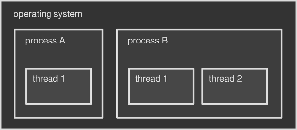
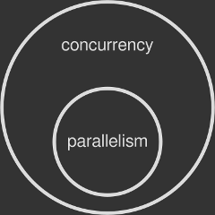

> 这是多线程、并发控制系列文章第一篇，本文内容主要来自[A gentle introduction to multithreading](https://www.internalpointers.com/post/gentle-introduction-multithreading)，并做了部分补充。
>
> 1. [多线程简述](https://github.com/pro648/tips/wiki/%E5%A4%9A%E7%BA%BF%E7%A8%8B%E7%AE%80%E8%BF%B0)
> 2. [并发控制之线程同步](https://github.com/pro648/tips/wiki/%E5%B9%B6%E5%8F%91%E6%8E%A7%E5%88%B6%E4%B9%8B%E7%BA%BF%E7%A8%8B%E5%90%8C%E6%AD%A5)
> 3. [并发控制之无锁编程](https://github.com/pro648/tips/wiki/%E5%B9%B6%E5%8F%91%E6%8E%A7%E5%88%B6%E4%B9%8B%E6%97%A0%E9%94%81%E7%BC%96%E7%A8%8B)

随着硬件的进步和操作系统更加智能化，程序运行速度和响应速度大幅提升。现代设备具有同时执行多项操作的能力。

编写使用多线程（multithreading）的软件既有趣又棘手，其要求对计算机底层有一定了解。线程（Thread）是操作系统提供的执行上述功能的工具，这篇文章将介绍线程，

## 1. 进程（Process）和线程（Thread）

现代的操作系统可以同时运行多个程序。因此，你可以在浏览器（一个程序）阅读这篇文章，同时在音乐播放器（另一个程序）上听音乐。每个程序都被称为正在执行的进程。操作系统拥有协调进程同时运行，以及如何利用底层硬件的技巧。最终，你会感觉程序同时在运行。

同时执行多个操作不一定同时运行多个进程，因为每个进程都可以在其内部同时运行多个子任务（sub-task），每个子任务称为线程。你可以将线程视为进程本身的一部分，每个进程启动时都会触发一个线程，通常称为主线程（main thread、primary thread）。随后，根据程序、开发人员需要启动、终止其他线程。多线程是在单个进程中运行多个线程。

例如，音乐播放器可能同时运行多个线程，一个用于渲染界面（通常为 main thread），一个用以播放音乐。

可以把操作系统视为包含多个进程的容器，进程是包含多个线程的容器。在这篇文章中，将仅关注线程。



#### 1.1 进程和线程的区别

操作系统为每个进程分配一块内存。默认情况下，进程间不能共享内存。例如，浏览器无法获取分配给音乐播放器的内存，音乐播放器也无法获取分配给浏览器的内存。运行同一程序的两个实例（即启动两次浏览器），操作系统会将每个实例当作一个单独进程，分配独立内存区域。因此，默认情况下，进程间无法共享数据，除非采用更为高级的技巧，即进程间通信（inter-process communication，简写 IPC）。

主要的进程间通信方法如下：

| 方法                       | 描述                                                         | 实现该方法的操作系统                                         |
| -------------------------- | ------------------------------------------------------------ | ------------------------------------------------------------ |
| 文件<br>File               | 在磁盘或文件服务器上存储的记录，可以由多个进程访问。         | 大部分操作系统                                               |
| 信号<br>Signal             | 系统消息从一个进程发送到另一个进程，一般用于发送指令，而非传输数据。 | 大部分操作系统                                               |
| 套接字<br>Socket           | 通过网络接口发送数据，可以是同一计算机上不同进程，也可以是网络上的另一计算机。 | 大部分操作系统                                               |
| Unix domain socket         | 与网络套接字类似，但所有通信发生在内核。Domain sockets 使用文件系统做为地址空间，进程将 domain socket 做为引用节点，并且多个进程可以与一个 socket  通信。 | 所有 POSIX 操作系统和 Windows 10                             |
| 消息队列<br>Message Queue  | 类似于 socket 的数据流，但通常保留消息边界。一般由系统实现，其允许多个进程读取、写入消息，而不直接交互。 | 大部分操作系统                                               |
| 匿名管道<br>Anonymous pipe | 利用标准输入和输出的单向数据管道，写入管道的写入端由操作系统进行缓存，直到从管道的读取端读取为止。通过使用相反方向上的两个管道可以实现进程间双向通信。 | 所有 POSIX 操作系统和 Windows                                |
| 命名管道<br>Named pipe     | 被视为文件的管道。Named pipe 不使用标准输入和输出，而是像普通文件一样，进程对命名管道进行写入和读取。 | 所有 POSIX 系统、Windows 和 AmigaOS 2.0+                     |
| 共享内存<br>Shared memory  | 多个进程被授权对于同一块内存的访问权限，该内存块创建了一个共享缓冲区，以使进程之间相互通信。 | 所有 POSIX 操作系统和 Windows                                |
| Message passing            | 允许多个程序使用消息队列和/或非操作系统管理的通道进行通信，常用于并发模型。 | 用于 RPC、RMI和MPI规范，Java RMI、CORBA、DDS、MSMQ、MailSlots、QNX等。 |
| Memory-mapped file         | 与 RAM 映射的文件，可以通过直接更改内存地址而不是输出到流来修改。这具有与标准文件相同的优点。 | 所有 POSIX 操作系统和 Windows                                |
与进程不同，线程之间共享操作系统分配给其父进程的内存块。音频播放引擎可以轻松访问音乐播放器主界面中的数据，反之亦然。因此，线程之间可以很方便的进行通信。线程更为轻量级、占用资源少、创建速度快。因此，线程也被称为轻量级的进程。

线程可以很方便的使程序同时执行多项任务。如果没有线程，则程序一次只能执行一项任务，在进程执行完毕后与系统进行同步。这将更加复杂（IPC棘手）和缓慢（进程比线程重）。

#### 1.2 绿色线程 Green Thread

到目前为止，提到的线程均是操作系统创建的。想要创建线程的进程必须与操作系统通信，但并非每个平台都原生支持线程。绿色线程（也称为光纤 fiber）是一种由运行环境或虚拟机调度，而不是由本地操作系统调度的线程，Green thread 并不依赖底层的系统功能，模拟实现了多线程的运行，这种线程的管理调度发生在用户空间，而非内核空间，所以 green thread 可以在没有原生线程支持的环境中工作。

由于绿色线程绕过了操作系统，其创建和管理速度更快，但也有缺点。下一篇文章[并发控制之线程同步](https://github.com/pro648/tips/wiki/%E5%B9%B6%E5%8F%91%E6%8E%A7%E5%88%B6%E4%B9%8B%E7%BA%BF%E7%A8%8B%E5%90%8C%E6%AD%A5)将介绍其缺点。

Green thread 名称来源于 Sun Microsystem 的 Green Team，Green team 在90年代设计了 Java 线程库。在2000年，Java 已经转移到原生多线程。Go、Haskell、Rust等语言仅实现了类似于绿色线程，用以代替原生线程。

## 2. 线程的用途

一个进程内使用多个线程可以并发处理任务，提高处理速度。假设要在电影编辑器中渲染电影，编辑器会将渲染操作分布到多个线程中，每个线程只处理电影的一部分。因此，如果一个线程渲染需要一个小时，两个线程同时渲染则需要30mins，四个线程同时渲染则需15mins。

但有以下三点需要考虑：

1. 不是每一个程序都需要多线程。如果 app 执行顺序任务，或需要等待用户输入，多线程可能没有太大好处。
2. 不是程序线程越多，其速度就会越快。每个子任务都必须经过仔细考虑和设计，以并行执行。
3. 并发的多线程并不能保证会并行处理，具体是否会并行需要根据硬件、当前状态来确定。

有一点需要注意，如果设备不支持同时执行多种操作，则操作系统必须伪造多任务并行。并行（parallelism）是任一时间多任务同时运行，并发（concurrency）指多任务同时发生，但未必会被同时执行。伪造并行是通过上下文切换，制造一种同时运行的错觉。

> 如果你对串行、并发、并行、同步、异步等术语不了解，点击[这里](https://github.com/pro648/tips/wiki/Grand-Central-Dispatch%E7%9A%84%E4%BD%BF%E7%94%A8#1-gcd%E6%9C%AF%E8%AF%AD)查看具体介绍。



## 3. 并发 Concurrency 与 并行 Parallelism

中央处理器（Central Processing Unit，简称 CPU）负责运行程序。CPU 由多个部分组成，主要部分是所谓的核心（Core），即实际执行计算的地方。任一时间单个 Core 只能执行一项任务。

任一时间单个 Core 只能执行一项任务限制了程序的运行。为此，操作系统开发了高级技术，即便是单核的设备，也能提供同时运行多个进程、线程的能力。其中最重要的一项技术是抢占式多任务处理（Preemptive Multitasking），在抢占式环境下，操作系统完全决定进度调度方案，操作系统可以剥夺任务的时间片，提供给其他任务，后续再恢复执行暂停的任务。

如果 CPU 仅具有一个内核，操作系统的任务之一就是将单个内核的计算资源分布给多个进程、线程，这些进程、线程将在一个循环中依次执行。这样会产生有多个程序或一个程序多项任务同时运行的假象，但此时并未实现真正的并行。

现在，CPU 一般都是多核，每个内核一次可以执行一项操作，也就是 CPU 具有两核及以上才能实现真正的并行。例如，Intel Core i7 拥有四核，其可以同时执行四个进程或线程。

操作系统可以检测 CPU 内核数量，并为其分配进程或线程。线程可能被分配到任一内核，这种调度对于程序完全透明。此外，所有内核均在执行任务时，仍然会采用 preemptive multitasking 技术，这样同时执行的任务数量可以大于内核数量。

#### 3.1 单核设备使用多线程的意义

单核设备不能实现真正的并行，但多线程仍然能带来性能提升。单进程内采用多个线程时，preemptive multitasking 可以让 app 的工作持续有进展，即使某个线程执行了缓慢、堵塞的任务。

例如，应用程序从低速磁盘读取数据，如果应用程序只有一个线程，在从磁盘读取完毕前整个程序都会卡死，等待磁盘唤醒时也在浪费 CPU 资源。当然，系统会同时执行其他进程，但你应用程序的任务没有任何进度。

如果使用了多线程，Thread A 负责读取磁盘数据，Thread B 负责更新主界面。Thread A 等待磁盘响应时，Thread B 依然可以更新界面，确保程序可以响应操作。CPU 通过切换当前执行的任务可以实现上述功能。

> 协作式多任务（Cooperative Multitasking）是一种同时处理多任务的技术。与抢占式多任务不同，协作式多任务要求每一个运行中的程序定时放弃自己的执行权力，告诉操作系统让下一个程序执行。如果有程序占用太多 CPU 时间，会导致整个系统变卡，因此现代大型系统很少使用 cooperative multitasking 技术。

## 4. 多线程带来的问题

同一进程内的所有线程共享同一块内存，这样同一个进程内的线程可以很方便的交换数据。例如，视频编辑器可以引用视频时间轴的内存区域，使用多个线程将视频渲染为文件，指向共享内存区域的句柄从该内存区域读取数据并将渲染的帧输出到磁盘。

多个线程同时从同一内存区域读取数据并不会出现问题，但同时有线程写入、读取就会出现问题。可能出现以下两个问题：

- 数据争用 Data Race：也称为数据竞争，一个线程修改数据时，另一个线程正在读取数据。如果写入还没有完成，就会读取到修改一半或损坏的数据。
- 竞争条件 Race Condition：也称为竞争冒险（Race Hazard）、竞态条件，指一个系统或进程的输出依赖不受控制的事件出现顺序或出现时机。举例来说，两个进程同时尝试修改共享内存的数据，在没有并发控制的情况下，最后的结果依赖于两个进程执行顺序和时机。如果发生了并发访问冲突，则结果不可预测。这一点比 data race 更微妙。即使已经避免了 data race，也可能触发 race condition。

#### 4.1 Data race 的原因

CPU 的内核一次只能执行一个机器指令。因为其不可分割为更小操作，被称为原子的（atomic）。希腊语的 atom 是不可分割（uncuttable）的意思。

不可分割的特点使原子操作本质上线程安全。当有线程对共享数据执行原子写入时，其他线程无法读取，也就不会读取到损毁的数据；相反，当有线程对共享数据执行读取操作时，其读取到那一刻的值。线程无法插入到执行原子操作的指令中间，因此不会出现数据争用。

坏消息是大多数操作不是原子的，即使像`x=1`这样简单的赋值，在很多硬件上也有由多个机器指令组成，导致整个赋值语句是非原子（non-atomic）的。当有线程读取 x 值，有线程执行赋值语句时，就会出现 data race。

#### 4.2 Race condition 的原因

Preemptive multitasking 赋予操作系统管理线程权限，其根据高级调度算法开始、终止、暂停线程，开发者无法控制执行时间和顺序。事实上，即使像下面这样简单的命令：

```
write_thread.start()
reader_thread.start()
```

也无法确定其执行顺序。执行多次会发现，有时先写入、有时先读取。如果程序希望先写入、后读取，这里就会遇到 race condition。

这种行为称为不确定性（non-deterministic），每次输出有变化、且无法预测。由于不能复现错误，竞争条件产生的问题难以调试。

> Data race 是多个线程同时访问共享资源，且至少一个线程尝试修改。
>
> Race condition 程序运行结果根据线程执行顺序、时机有关。

许多 race condition 是由 data race 引起的，很多 data race 会导致 race condition。但没有 data race 时可能出现 race condition，没有 race condition 也可能出现 data race。具体可以查看[Race Condition vs. Data Race](https://blog.regehr.org/archives/490)这篇文章。

## 5. 并发控制 Concurrency Control

Data race 和 race condition 都是经常遇到的问题，协调多个线程的技术称为并发控制（concurrency control）。操作系统和编程语言都会提供一些解决方案，以下是常用的几个：

- 同步 Synchronization：确保资源一次只能由一个线程使用。synchronization 是指将代码特定部分标记为受保护（protected），以便并发线程不会同时执行它，进而保护了数据。[并发控制之线程同步](https://github.com/pro648/tips/wiki/%E5%B9%B6%E5%8F%91%E6%8E%A7%E5%88%B6%E4%B9%8B%E7%BA%BF%E7%A8%8B%E5%90%8C%E6%AD%A5)会介绍同步的具体细节。
- 原子操作 atomic operation：使用操作系统提供的特殊指令，可以将非原子操作变成原子操作，如前面提到的赋值操作。这样即使多线程同时操作数据，也不会出现问题。[并发控制之无锁编程](https://github.com/pro648/tips/wiki/%E5%B9%B6%E5%8F%91%E6%8E%A7%E5%88%B6%E4%B9%8B%E6%97%A0%E9%94%81%E7%BC%96%E7%A8%8B)会介绍原子操作的具体细节。
- 不可变数据 Immutable data：将共享数据标记为不可变，不允许修改，只支持读取。因为多个线程可以同时读取共享数据，只要没有线程修改就不会出现问题。这也是函数式编程的主要原理。

> 下一篇：[并发控制之线程同步](https://github.com/pro648/tips/wiki/%E5%B9%B6%E5%8F%91%E6%8E%A7%E5%88%B6%E4%B9%8B%E7%BA%BF%E7%A8%8B%E5%90%8C%E6%AD%A5)